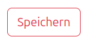

# robots-dreams/footstep
## PHP classes to render bootstrap elements


The package is still a work in progress and will be extended in the future.

At the moment only buttons are supported.

### Example Usage:
```
<?php echo new Button(TypeEnum::SUCCESS, 'Speichern') ?>
```
renders to:


---

```
<?php echo new Button(TypeEnum::WARNING, 'Speichern', outline: OutlineType::OUTLINE) ?>
```
renders to:


---

```
<?php echo new Button(TypeEnum::DARK, 'Speichern', ButtonSizeEnum::SM, OutlineType::OUTLINE) ?>
```
renders to:


---

```
<?php echo new Button(TypeEnum::DANGER, 'Speichern', ButtonSizeEnum::LG, OutlineType::OUTLINE) ?>
```
renders to:


---

```
<?php echo new Button(TypeEnum::INFO, 'Speichern', disabled: true) ?>
```
renders to:

